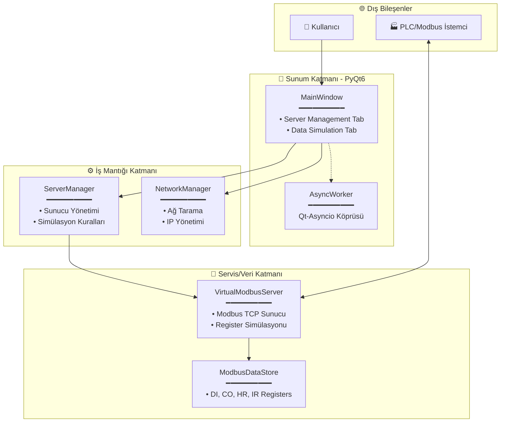

# Multi-Modbus Server Simülasyonu

Bu proje, Python ve PyQt6 kullanılarak geliştirilmiş, aynı anda birden fazla Modbus TCP sunucusunu (Slave cihaz) simüle etmenizi sağlayan bir araçtır. Endüstriyel otomasyon testleri, SCADA sistemleri ve PLC haberleşme denemeleri için tasarlanmıştır.


## Özellikler

*   **Çoklu Sanal Cihaz:** İstenilen sayıda sanal Modbus sunucusu oluşturabilirsiniz.
*   **Ağ Tarayıcı ve Otomatik IP Tanımlama:** Ağdaki (örneğin Wi-Fi Hotspot) boş IP adreslerini tarar ve bunları bilgisayarınıza otomatik olarak ekler.
*   **Özelleştirilebilir Ağ Ayarları:** Her sunucu için ayrı IP adresi ve Port numarası belirleyebilirsiniz.
*   **Gelişmiş Veri Simülasyonu (YENİ):** 
    *   Her sunucunun ilk 10 Holding Register'ı (Adres 0-9) için özel simülasyon kuralları tanımlayabilirsiniz.
    *   **Toggle:** Belirlenen sürede 0 ve 1 arasında geçiş yapar.
    *   **Counter:** Belirlenen sürede değeri sürekli artırır.
*   **Kullanıcı Dostu Arayüz:** Sekmeli yapı ile sunucu yönetimi ve simülasyon ayarları kolayca yapılabilir.

## Mimari

Proje, **MVC (Model-View-Controller)** mimarisi ve **Asyncio** tabanlı asenkron yapı üzerine kurulmuştur.



## Kurulum

Projenin çalışması için Python kurulu olmalıdır.

1.  Gerekli kütüphaneleri yükleyin:
    ```bash
    pip install -r requirements.txt
    ```

2.  **ÖNEMLİ:** Ağ özelliklerini (IP tarama ve ekleme) kullanabilmek için uygulamayı **Yönetici Olarak (Run as Administrator)** çalıştırmanız gerekir.
    ```bash
    # Terminali Yönetici olarak açın ve:
    python main.py
    ```

## Kullanım

### Sekme 1: Server Management (Sunucu Yönetimi)

#### Otomatik Ağ Kurulumu (Önerilen)
Bu yöntem, ağdaki boş IP'leri bulur ve sizin için ayarlar.

1.  **Interface** listesinden ağ kartınızı seçin (Örn: `Wi-Fi`).
2.  **Start IP** kısmına taramanın başlayacağı IP adresini yazın (Örn: `192.168.43.50`).
3.  **Port** kısmına sunucuların çalışacağı portu girin (Örn: `5020`).
4.  **Count** kısmına kaç adet sunucu istediğinizi yazın (Örn: `5`).
5.  **Scan & Claim IPs** butonuna tıklayın.

#### Manuel Ekleme
Eğer IP adreslerini kendiniz belirlemek istiyorsanız **Manual Add** bölümünü kullanın.

### Sekme 2: Data Simulation (Veri Simülasyonu)

Bu sekmede, oluşturduğunuz sunucuların register değerlerini otomatik olarak değiştirecek kurallar tanımlayabilirsiniz.

1.  **Select Server:** İşlem yapmak istediğiniz sunucuyu seçin.
2.  **Tablodan Seçim:** Listeden kural uygulamak istediğiniz register'ları seçin (Örn: Holding Register 0). Çoklu seçim yapabilirsiniz.
3.  **Kural Yapılandırma:**
    *   **Function:** `Toggle (0/1)` veya `Counter` seçin.
    *   **Interval:** Değişim sıklığını (saniye) girin.
4.  **Apply:** Butona basarak kuralı uygulayın.

## ⚠️ PLC ve Ağ Bağlantısı Hakkında

Ağdaki gerçek bir PLC'nin bu simülasyona bağlanabilmesi için:

1.  **Doğru IP Kullanımı:** Sunucuları `127.0.0.1` yerine, ağdaki gerçek IP bloklarından (Örn: `192.168.x.x`) oluşturmalısınız. Otomatik kurulum bunu sizin için yapar.
2.  **Erişim:** PLC ve Bilgisayar aynı ağda (örneğin aynı Wi-Fi veya Switch üzerinde) olmalıdır.
3.  **Port:** Varsayılan port `5020`'dir. PLC ayarlarında bu portu kullanmayı unutmayın.
